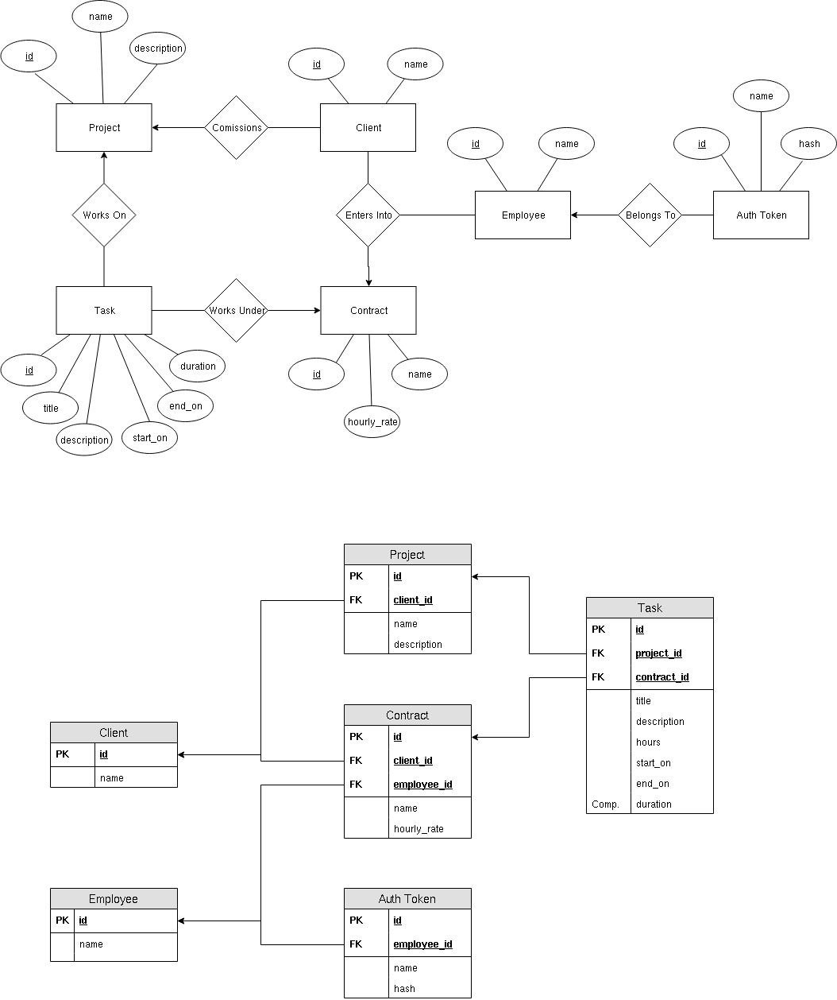

[](https://godoc.org/github.com/Noah-Huppert/time-tracker/api)

# API
Data storage and logic.

# Table Of Contents
- [Overview](#overview)
- [Development](#development)
- [Design](#design)

# Overview
Go RESTful API. Data stored in Postgres.

# Development
## Requirements
Go must be installed with support for Go modules.

Podman must be installed in order to run the local Postgres server. If you would
like to use Docker export the env var: `CONTAINER_CLI=docker`.

## Instructions
Start a Postgres server:

```
make db
```

Run database migrations:

```
make migrate-db
```

Then run the server:

```
make run
```

To run tests:

```
make test
```

# Design
## Data Model

